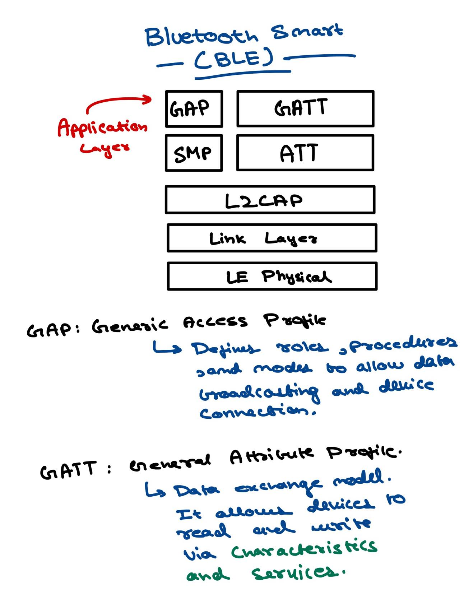
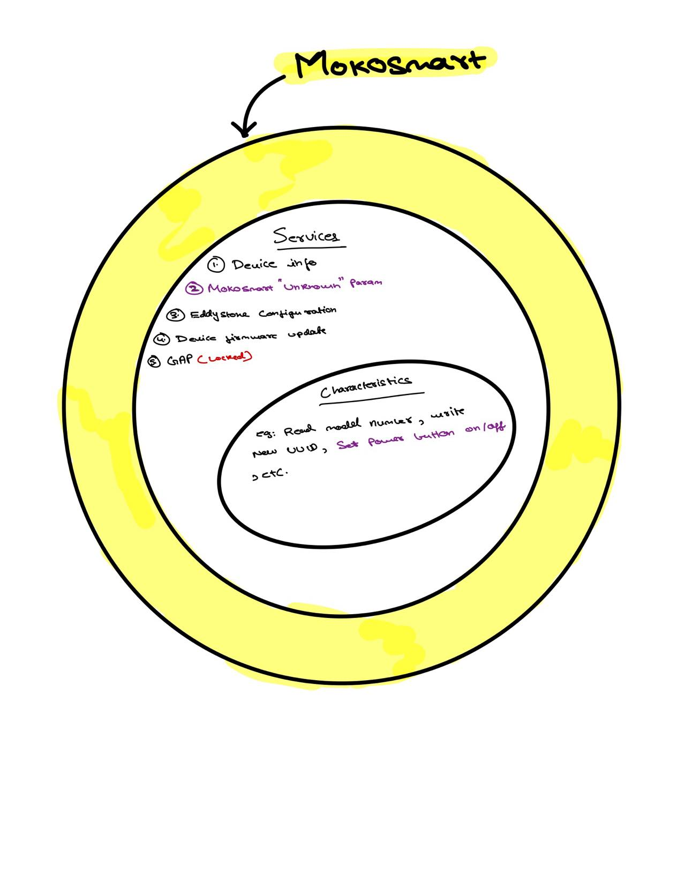

# Mokosmart Bluetooth Beacons

<h2 id="header_install">Install and Run Instructions</h1>
Firstly, clone the repository and enter the directory on your terminal.

```shell
$ git clone https://github.com/lakshjaisinghani/CYCLED-beacon-util.git
$ cd CYCLED-beacon-util
```

Once in the directory, install all the dependencies required to run the bluetooth utility using pip.
```shell
$ pip install -r requirements.txt
```
Check out the command line arguments available:
```shell
$ python .\beacon_util.py -h

usage: beacon_util.py [-h] [--save_factor SAVE_FACTOR] [--enable_button ENABLE_BUTTON]

Turn the button functionality of the bluetooth beacon on/off.

optional arguments:
  -h, --help            show this help message and exit
  --save_factor SAVE_FACTOR
                        How often to save data to csv? (Number of discover iterations)
  --enable_button ENABLE_BUTTON
                        Turn button functionality on (True) or off (False)?
```

You can then run the python file with the appropriate command line arguments.
```shell
$ python .\beacon_util.py --save_factor 10 --enable_button False
```

## Quick intro to the csv database
The csv databse would be stored in the `database` file in the main `CYCLED-beacon-util` directory. Here is what it would look like.

```
mac_add,address,major,minor,button_status
E4:64:B0:40:19:CA,251121104853450,18,56766,0
CF:B9:B1:9E:5C:EC,228396455845100,18,57926,0
EF:13:D3:D8:8E:F0,262868437602032,18,23705,0
FE:89:B4:DA:3E:E9,279867398176489,18,54948,3
F9:65:5A:BD:17:3F,274213709354815,18,14354,0
EF:8B:0A:9C:B6:5D,263380457535069,18,27359,0
E1:8C:04:F3:E4:0F,247991494763535,18,54170,3
DF:67:A5:1E:E4:25,245636244890661,18,45582,0
C2:A1:DE:F3:E7:B3,214000486049715,18,40518,3
```
The last column `button_status` is the most important. It shows you what is the current button mode is.

```
0 - Button Funtionality is Off (--enable_button argument was set to False).
1 - Button Funtionality is On  (--enable_button argument was set to True).
2 - A Gatt protocol error occured.
3 - Unknown error occured (device accidentaly disconnected).
```


# Intro to BLE

Bluetooth Low Energy (BLE), sometimes referred to as "Bluetooth Smart", is a light-weight subset of classic Bluetooth and was introduced as part of the Bluetooth 4.0 core specification. While there is some overlap with classic Bluetooth, BLE actually has a completely different lineage and was started by Nokia as an in-house project called 'Wibree' before being adopted by the Bluetooth SIG.There are plenty of wireless protocols out there for engineers and product designers, but what makes BLE so interesting is that it's almost certainly the easiest way to design something that can talk to any modern mobile platform out there (iOS, Android, Windows phones, etc.), and particularly in the case of Apple devices it's the only HW design option that doesn't require you to jump through endless hoops to be able to legally market your product for iOS devices.This guide will give you a quick overview of BLE, specifically how data is organized in Bluetooth Low Energy, and how devices advertise their presence so that you can connect to them and start passing data back and forth.



## BLE Platform Support

Support for Bluetooth 4.0 and Bluetooth Low Energy (which is a subset of BT 4.0) is available on most major platforms as of the versions listed below:

- iOS5+ (iOS7+ preferred)
- Android 4.3+ (numerous bug fixes in 4.4+)
- Apple OS X 10.6+
- Windows 8 (**XP, Vista and 7 only support Bluetooth 2.1**)
- GNU/Linux Vanilla BlueZ 4.93+

### iBeacon and Eddystone

Link: [https://kontakt.io/ibeacon-and-eddystone/](https://kontakt.io/ibeacon-and-eddystone/)


The iBeacon profile is the first, and currently most commonly discussed, communication protocol around. It is not a physical hardware but rather the language used to power the physical “beacon” technology we picture. Developed by Apple, it is natively supported in iOS and has deep integrations with the mobile OS. Although the iBeacon profile works on other mobile operating systems, it works best in the environment for which it was designed: iPhones and iPads.


The Eddystone format is a new and open communication protocol developed by Google with Android users in mind.

We often compare beacons to a lighthouse; they’re just simple objects constantly sending out a signal. Perhaps that’s the reason Google named their beacon format after the Eddystone Lighthouse in the UK. More importantly, though strikingly similar to iBeacon, it is distinctly Google (or, at least, non-Apple). The protocol is now known for being “open,” created with the input and collaboration of several companies. Instead of being created to power highly specific user-facing apps, its key qualities are interoperability and long-term strength.

This is made clear in its relation and importance to the Physical Web. The Physical Web is more like the overarching idea we have about wireless connectivity. It’s a form the IoT could take—making the digital and physical work together through beacons.

In the end, though the two formats are often mixed up, they represent pretty different ways of using the IoT.

## MokoSmart Beacons

Documentation: [http://doc.mokotechnology.com/index.php?s=/9&page_id=34](http://doc.mokotechnology.com/index.php?s=/9&page_id=34)

Android SDK: [https://github.com/BeaconX-Pro/Android-SDK/tree/22e9124772e304aff98b974f39d8af02df116e26](https://github.com/BeaconX-Pro/Android-SDK/tree/22e9124772e304aff98b974f39d8af02df116e26)

IOS SDK: [https://github.com/BeaconX-Pro/iOS-SDK](https://github.com/BeaconX-Pro/iOS-SDK) 

ANdroid Nordic SDK: [https://github.com/BeaconX-Pro/Android-Nordic-SDK](https://github.com/BeaconX-Pro/Android-Nordic-SDK)

### MokoSmart Beacon Services and Characteristics



### Service

a3c87500-8ed3-4bdf-8a39-a01bebede295 (Handle: 54): Eddystone Configuration Service

**Characteristics**

a3c8750c-8ed3-4bdf-8a39-a01bebede295 (Handle: 71): (Advanced) Remain Connectable

a3c8750b-8ed3-4bdf-8a39-a01bebede295 (Handle: 69): (Advanced) Factory reset

a3c8750a-8ed3-4bdf-8a39-a01bebede295 (Handle: 67): ADV Slot Data

a3c87507-8ed3-4bdf-8a39-a01bebede295 (Handle: 65): Unlock

a3c87506-8ed3-4bdf-8a39-a01bebede295 (Handle: 63): Lock State

a3c87505-8ed3-4bdf-8a39-a01bebede295 (Handle: 61): (Advanced) Advertised Tx Power

a3c87504-8ed3-4bdf-8a39-a01bebede295 (Handle: 59): Radio Tx Power

a3c87503-8ed3-4bdf-8a39-a01bebede295 (Handle: 57): Advertising Interval

a3c87502-8ed3-4bdf-8a39-a01bebede295 (Handle: 55): Active Slot

### Service

e62a0001-1362-4f28-9327-f5b74e970801 (Handle: 36): Unknown

**Characteristics**

e62a0008-1362-4f28-9327-f5b74e970801 (Handle: 51): Unknown

e62a0007-1362-4f28-9327-f5b74e970801 (Handle: 48): Unknown

e62a0006-1362-4f28-9327-f5b74e970801 (Handle: 46): Unknown

e62a0005-1362-4f28-9327-f5b74e970801 (Handle: 44): Unknown

e62a0004-1362-4f28-9327-f5b74e970801 (Handle: 42): Unknown

e62a0002-1362-4f28-9327-f5b74e970801 (Handle: 40): Unknown

e62a0003-1362-4f28-9327-f5b74e970801 (Handle: 37): Unknown

### Service

00001530-1212-efde-1523-785feabcd123 (Handle: 28): Device Firmware Update Service

**Characteristics**

00001534-1212-efde-1523-785feabcd123 (Handle: 34): DFU Version

00001531-1212-efde-1523-785feabcd123 (Handle: 31): DFU Control Point

00001532-1212-efde-1523-785feabcd123 (Handle: 29): DFU Packet

### Service

0000180a-0000-1000-8000-00805f9b34fb (Handle: 11): Device Information

**Characteristics**

00002a28-0000-1000-8000-00805f9b34fb (Handle: 22): Software Revision String

00002a26-0000-1000-8000-00805f9b34fb (Handle: 20): Firmware Revision String

00002a27-0000-1000-8000-00805f9b34fb (Handle: 18): Hardware Revision String

00002a25-0000-1000-8000-00805f9b34fb (Handle: 16): Serial Number String

00002a24-0000-1000-8000-00805f9b34fb (Handle: 14): Model Number String

00002a29-0000-1000-8000-00805f9b34fb (Handle: 12): Manufacturer Name String

### Service

00001801-0000-1000-8000-00805f9b34fb (Handle: 10): Generic Attribute Profile

### Some important Links

[https://github.com/BeaconX-Pro/Android-SDK/blob/22e9124772e304aff98b974f39d8af02df116e26/mokosupport/src/main/java/com/moko/support/entity/OrderCHAR.java](https://github.com/BeaconX-Pro/Android-SDK/blob/22e9124772e304aff98b974f39d8af02df116e26/mokosupport/src/main/java/com/moko/support/entity/OrderCHAR.java)

[https://github.com/BeaconX-Pro/Android-Nordic-SDK/blob/cc1759b356994a5426abc558242b6d006976022b/mokosupport/src/main/java/com/moko/support/nordic/task/ParamsTask.java#L49](https://github.com/BeaconX-Pro/Android-Nordic-SDK/blob/cc1759b356994a5426abc558242b6d006976022b/mokosupport/src/main/java/com/moko/support/nordic/task/ParamsTask.java#L49) 

## BLE Python Library

[GitHub - hbldh/bleak: Bluetooth Low Energy platform Agnostic Klient for Python](https://github.com/hbldh/bleak)

Documentation: [https://bleak.readthedocs.io/en/latest/installation.html](https://bleak.readthedocs.io/en/latest/installation.html)

Examples: [https://github.com/hbldh/bleak/tree/develop/examples](https://github.com/hbldh/bleak/tree/develop/examples)

### Issue Commonly Faced: Allow bluetooth acess through permissions

[https://github.com/hbldh/bleak/issues/438](https://github.com/hbldh/bleak/issues/438)

